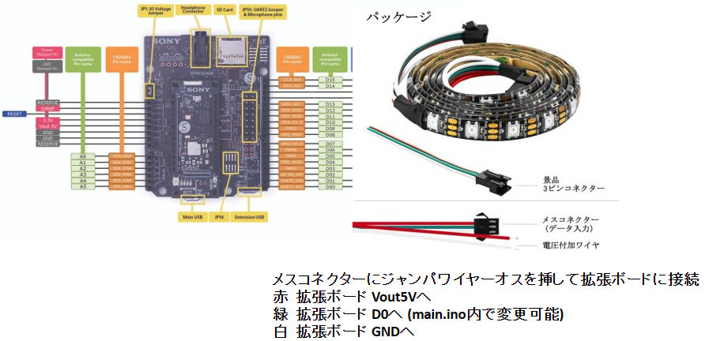

# music_led_performer

## HW準備
- Spresense, 拡張ボード, LCD, Cameraを接続する。
- 拡張ボードとLED Strapを接続する。

## 必要なライブラリ
下記ライブラリをZIPでDownloadしてArduino IDEにセットアップする。
- [nepils](https://github.com/KotaMeiwa/nepils/archive/refs/heads/develop.zip)
- [Adafruit_NeoPixel](https://github.com/KotaMeiwa/Adafruit_NeoPixel/archive/refs/heads/master.zip)
- [QR_decode_for_Arduino](https://github.com/KotaMeiwa/QR_decode_for_Arduino/archive/refs/heads/main.zip)
- [SP_Audio](https://github.com/KotaMeiwa/SP_Audio/archive/refs/heads/master.zip)

## 本ライブラリのセットアップ
同様にZIPでDownloadしてArduino IDEにセットアップする。
- [music_led_performer](https://github.com/KotaMeiwa/music_led_performer/archive/refs/heads/development.zip)

セットアップしたライブラリは下記フォルダ以下に配置される。（Windowsデフォルト）

**C:/Users/< login user name >/Documents/Arduino/libraries**

## ビルド&デプロイ
3つのスケッチで構成されている。
- music_led_performer/example/main
  
    Camera + Audio制御
- music_led_performer/example/sub1

    LCD + QRCODE読み取り
- music_led_performer/example/sub2

    LED Strap制御

sub2, sub1, main  の順でビルド&デプロイしてください。

mainのメモリサイズは768 KB(default)に設定すること。

sub1, sub2はArduino IDEが適切にメモリサイズ設定してくれます。

## 実行中の制御
下記3つの文字列をQRCODEにエンコードして、カメラの前にかざしてください。
- http://Run    Audio/LED Strap開始。現在位置から。
- http://Still  Audio/LED Strap停止。現在位置保持。
- http://Stop   Audio/LED Strap停止。現在位置先頭に戻る。

QRCODE画像は **music_led_performer/QR-code/QR-code2.png**   をお使いください。

